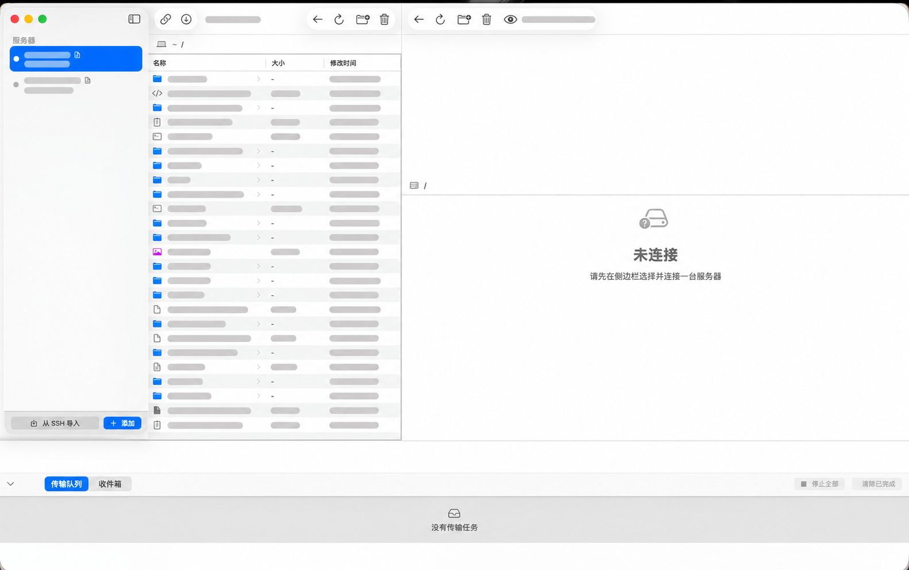

# Dropship

Mac 与 Linux 服务器之间的拖拽式文件互传工具。Dropship 使用原生 SwiftUI 构建：左侧浏览
Mac 文件，右侧浏览服务器文件，拖过去即可传输。

本地只依赖系统自带的 `ssh`，无需开放额外公网端口或修改服务器防火墙。

**当前版本：0.2.0 · macOS 14+ · Apple Silicon**



## 核心能力

- Mac 与服务器之间双向拖拽文件和目录
- 精准投放到指定目录，空白区域则使用当前目录
- 本地文件支持右键打开和双击打开
- 同名文件支持覆盖、跳过、自动重命名和应用到全部
- 大文件断点续传、传输进度、批量停止和完成记录清理
- 服务器可通过反向收件隧道主动向 Mac 推送文件
- 默认 Agent 模式，并提供无需部署二进制的 SFTP 降级模式

## 安装

### 使用 DMG（推荐）

1. 从 [GitHub Releases](https://github.com/xuzihan0823/dropship/releases) 下载
   `Dropship-v0.2.0-macos-arm64.dmg`。
2. 打开 DMG，将 `Dropship.app` 拖入 `Applications`。
3. 从“应用程序”目录启动 Dropship。

当前预编译版本面向 Apple Silicon Mac（arm64）。

> [!IMPORTANT]
> 当前应用使用 ad-hoc 签名，没有 Developer ID 分发签名，也未经 Apple 公证。macOS
> 首次运行时可能阻止打开，可在“系统设置 → 隐私与安全性”中选择“仍要打开”，或者执行：

```bash
xattr -dr com.apple.quarantine /Applications/Dropship.app
```

### 从源码构建

构建需要 Xcode（Swift 6 工具链）和 Go：

```bash
git clone https://github.com/xuzihan0823/dropship.git
cd dropship
./scripts/build-app.sh release
open build/Dropship.app
```

## 快速开始

1. 打开应用，点击侧边栏底部的“从 SSH 导入”，从 `~/.ssh/config` 选择服务器；也可以点击
   “添加”手动填写。
2. 选中服务器并点击连接按钮。
3. 在左右文件面板之间拖拽文件。拖到目录行会传入该目录，拖到空白处会传入当前目录。

也可以从 Finder 拖入本地文件，或把远程文件拖到 Finder；后者会在松手后开始下载并交付文件。

## Agent 与 SFTP

| 能力 | Agent 模式（默认） | SFTP 降级模式 |
|---|---|---|
| 服务器改动 | 安装约 2.5 MB 的静态二进制 | 不部署 Dropship 二进制 |
| 传输保护 | 强制大小校验、临时文件、原子替换 | 临时文件与最终大小校验 |
| 哈希能力 | BLAKE3 远端哈希 | 无远端哈希 |
| 远端操作 | 结构化协议 | 依赖 `find`、`stat` 等 shell 命令 |
| 支持平台 | linux/amd64、linux/arm64 | 任何可通过 SSH 使用兼容命令的服务器 |

### Agent 模式的优势

Agent 通过现有 SSH 会话的 `--stdio` 工作，不监听端口，也不是常驻守护进程。上传时先写入
`.dropship-part`，强制校验实际字节数，校验通过后才原子替换正式文件；SSH 中断时会保留
临时文件用于续传，而不会用半截数据覆盖原文件。Agent 还提供结构化进度、真实错误、远端
哈希及文件操作，减少 shell 输出差异带来的兼容性问题。

连接时，Dropship 只会在 Agent 缺失或版本不匹配时安装或更新：

| 项目 | 内容 |
|---|---|
| 安装位置 | `$HOME/.local/share/dropship/agent` |
| 文件权限 | `0755` |
| 运行周期 | 每次连接启动 `agent --stdio`，断开后进程结束 |
| 保留内容 | 断开后仅保留 Agent 二进制，便于下次复用 |

Agent 的源码位于 [`agent/`](agent/)，完整协议见
[`docs/PROTOCOL.md`](docs/PROTOCOL.md)。

### 只使用 SFTP

如果服务器不允许部署二进制，可在服务器编辑界面关闭“允许部署并执行 Dropship Agent”。
该设置按服务器独立保存，重新连接后生效；Agent 不可用时，Dropship 也会自动降级为 SFTP。
当前使用的模式会显示在服务器名称下方。

## 反向收件隧道

开启某台服务器的收件隧道后，可以从服务器主动把文件推送到 Mac：

```bash
~/.local/share/dropship/dropship-send <文件或目录>
```

文件默认保存到 `~/Downloads/Dropship`，可在设置中修改；目录会自动打包为 `.tar.gz`。
隧道通过 SSH 反向端口转发建立，只监听服务器回环地址，不对外暴露端口。安全边界详见
[`docs/PROTOCOL.md`](docs/PROTOCOL.md) §7.6。

## 已知限制

- 客户端要求 macOS 14+
- 当前预编译 DMG 仅提供 arm64 版本
- Agent 仅支持 linux/amd64 与 linux/arm64，其它平台会尝试降级到 SFTP
- SFTP 续传只校验最终总字节数，不校验已有 `.part` 前半段内容
- 尚无 Developer ID 分发签名、Apple 公证、自动更新和崩溃上报

## 开发

```bash
swift build                 # 编译
swift test                  # 运行测试
./scripts/build-app.sh      # 构建 .app（包含 Linux Agent）
./scripts/build-dmg.sh      # 构建 release DMG 与 SHA-256
```

修改 Agent 或客户端传输实现前，请先阅读 [`docs/PROTOCOL.md`](docs/PROTOCOL.md)。

## License

待定。
